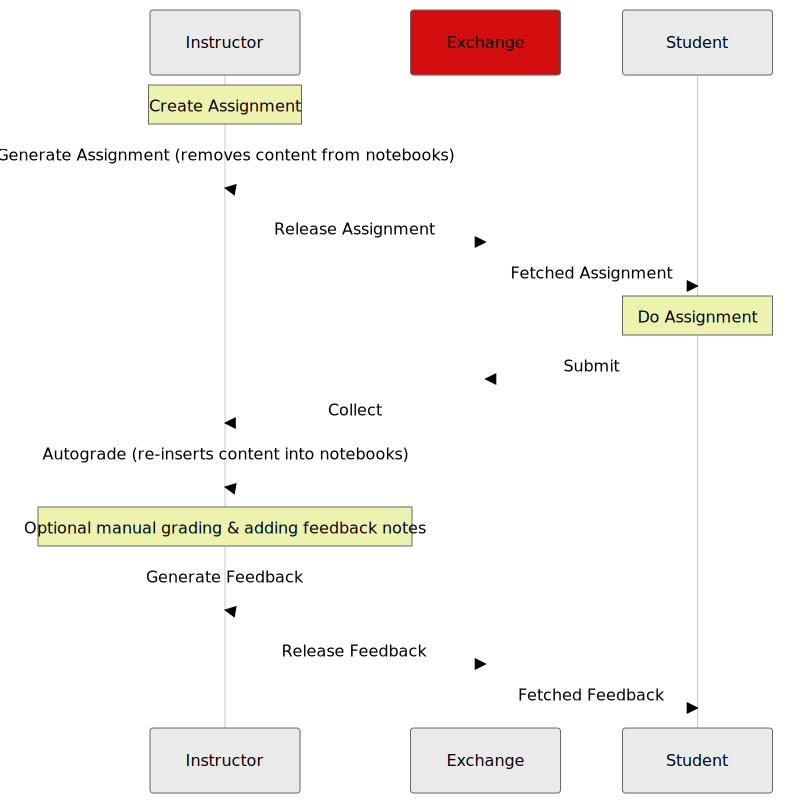

# How the nbexchange plugins work

This is an overview of how the exchange mechanism works in NBGrader, and how these plugins interact with that mechanism.

## Recap of assignment cycle

The workflow of assignments can be seen in this graphic, with the exchange is responsible for all the red parts: copying assignments (and feedback) between instructor and student:



The expected behaviour of the exchange for each of those actions is given in the [nbgrader documentation on its exchange](https://nbgrader.readthedocs.io/en/stable/exchange/exchange_api.html#expected-behaviours) documentation.

## nbexchange_jlab plugins

The plugins in this extension provide the appropriate Classes for nbgrader to seamlessly transfer files through an [NBExchange](https://github.com/edina/nbexchange) service

### Configuration considerations

There are four primary pieces of configuration to consider:

- api_plugin_class
- base_path
- base_service_url
- _the various exchange plugins_

**api_plugin_class**
The remote exchange service will want to authenticate connections, and get some identity details (see the [documentation on nbexchange user_plugin_class](https://github.com/edina/nbexchange/tree/master?tab=readme-ov-file#user_plugin_class-revisited)) - this is where you define the class that creates the cookies/token/whatever that is included in the request sent to the exchange service.

Naturally, there will be a tight correlation between this class and the `user_plugin_class` in the `nbexchange` server (or the equivelant in whatever service you're using.)

This plugin class needs to provide a single [public] method: `prep_api_call`

**base_path**
When the plugins call the remote exchange service, that service may well have some leading _path part_ (this is a requirement when an exchange service is run under JupyterHub). This _path part_ will need to match any value defined in the remote exchange service.

**base_service_url**
This is the web-address of the remote exchange. This may be a public [DNS'd] hostname, or an internal cluster service-name.

**_exchange plugins_**
These are the various entries that map an nbgrader exchange _action_ to a specific Class

## Details on authenticated connections.

The plugins have a central `api_request` method, which does the actual `http` request to the external service. As part of that request, it does

```python
url, cookies, headers = self.prep_api_call(path)
```

(where `path` is the url needed to get the requested information: "list" vs "collect" vs "submit", etc)

`self.prep_api_call()`, in turn, is mapped to the `self.api_plugin_class.prep_api_call()` - where `self.api_plugin_class` points to the class defined for yoiur particular setup.

The `prep_api_call` function needs to return 3 things:

- the full `url` for the request ( `<base_service_url>/<base_path>/<path>` - eg: `https://example.com/foo/list?course=code`)
- any `cookies` to include with the request
- any `headers` to set for the request

(See the [README](README.md) for an example.)

# The History extension

Knowing that the exchange service has a list of actions (see [NBExchange docs](https://github.com/edina/nbexchange/blob/master/how_it_works.md)), and the service has a `history` API-endpoint, then displaying a users interactions is feasable.

The remote extension already filters the actions: a student only sees `assignment-release` actions [by anyone], and their own actions; instructors see _all_ actions.

The current page gets actions for _all_ courses the user is "subscribed to" [according to the exchange], and the appropriate actions for that course.

The page then runs through the courses in reverse-chronological order (newest first), and groups actions by type.

Data is displayed in `details/summary` sets
