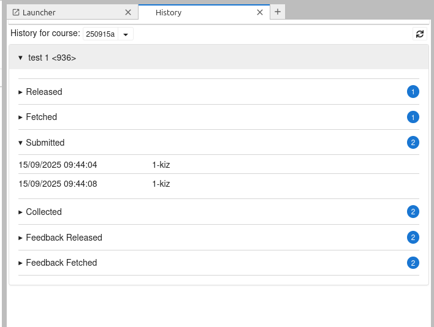

# NbExchange JupyterLab Plugin

A JupyterLab extension which provides the plugins for [nbgrader](https://github.com/jupyter/nbgrader) to use [NbExchange](https://github.com/edina/nbexchange) as an external Exchange service.

It is composed of a Python package named `nbexchange_jlab` for the server extension and a NPM package named `nbexchange_jlab` for the frontend extension.

## Additional Functionality

In addition to the usual suite of plugins for exchanging files, the plugin provides a `History` option to the Nbgrader menu - this is a visual render of NbExchanges `history` endpoint:



The current course is shown in green, and each course indicates the first and last date of any activity _for the whole course_

## Requirements

- JupyterLab >= 4.0.0
- NbGrader

## Installation

The primary reference for this should be the `nbgrader` documentation - but in short:

1. Install `nbexchange_jlab_plugin` into your jupyter environment [from github, using pip]

- This will also install `nbgrader` - this release installs 0.9.5 (which makes it compatible with JupyterLab & Notebook 7)

3. Include the following in your `nbgrader_config.py` file:

```python
c.ExchangeFactory.exchange = 'nbexchange_jlab.plugins.Exchange'
c.ExchangeFactory.list = 'nbexchange_jlab.plugins.ExchangeList'
c.ExchangeFactory.release_assignment = 'nbexchange_jlab.plugins.ExchangeReleaseAssignment'
c.ExchangeFactory.fetch_assignment = 'nbexchange_jlab.plugins.ExchangeFetchAssignment'
c.ExchangeFactory.submit = 'nbexchange_jlab.plugins.ExchangeSubmit'
c.ExchangeFactory.collect = 'nbexchange_jlab.plugins.ExchangeCollect'
c.ExchangeFactory.release_feedback = 'nbexchange_jlab.plugins.ExchangeReleaseFeedback'
c.ExchangeFactory.fetch_feedback = 'nbexchange_jlab.plugins.ExchangeFetchFeedback'
```

(note the change to `plugins`, _plural_)

These plugins will also check the size of _releases_ & _submissions_

`c.Exchange.max_buffer_size = 204800  # 200KB`

[or even a more specific `c.ExchangeSubmit.max_buffer_size = 204800 # 200KB`]

By default, upload sizes are limited to 5GB (5253530000)

The figure is bytes

### Configuring the plugins to talk to the NbExchange server

The plugins make http requests to the server, which requires it to prepare several things:

- `base_service_url` is the `http origin` of the NbExchange service - we default this to `https://noteable.edina.ac.uk`, 'cos.... _advertising_
- `base_path` is the path-part of requests into the exchange. This needs to match `base_url` defined in the NbExchange service, and (likewise) defaults to `/services/nbexchange/`.
- `api_plugin_class` is the name of the class that sets up headers, cookies, etc for the `api_request` to call the external exchange
  - Whatever is used here needs to match whatever the [nbexchange `get_current_user`](https://github.com/edina/nbexchange?tab=readme-ov-file#user_plugin_class-revisited) will use to identify the user.
  - This see the `test_plugin_exchange_with_bespoke_apiPlugin.py` test file for an simplistic example using JSON Web Tokens

eg:

```python
from nbexchange_jlab.plugins import BaseApiPlugin

class AuthApiPlugin(BaseApiPlugin):
    def prep_api_call(self, path):

        # Gets an HTTP Authentication Token
        auth_token = _some_magic_function()
        cookies = dict()
        headers = dict()

        if auth_token:
            headers["Authorization"] = f"Basic {auth_token}"

        url = self.service_url() + path
        return url, cookies, headers
c.Exchange.api_plugin_class = AuthApiPlugin
c.Exchange.base_service_url = 'https://nbexchange.example.com'
c.Exchange.base_path = '/services/exchange'

```

## Contributing

See [Contributing.md](CONTRIBUTING.md) for details on how to extend/contribute to the code.
